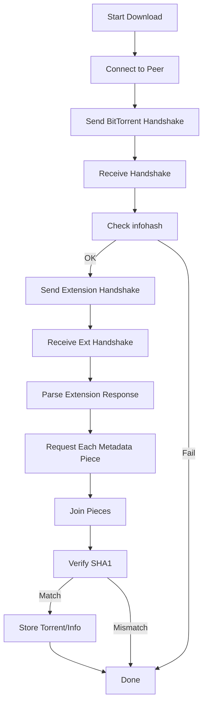

# L-Spider Documentation

L-Spider is a Distributed Hash Table (DHT) spider designed to sniff torrents and magnet links from the BitTorrent DHT network. It collects infohashes, downloads metadata, and can save both magnet links and full torrent files. The project is modular, robust, and can serve as the base for research, indexing, or data collection operations related to BitTorrent.

---

## Overview

L-Spider operates by joining the BitTorrent DHT network, listening for infohashes, and attempting to retrieve torrent metadata from discovered peers. It stores results as magnet links and optionally as `.torrent` files. The system is composed of multiple scripts, each handling a specific aspect of the DHT crawling and torrent metadata collection process.

---

## File-by-File Documentation

### `README.md`

Provides an introduction to L-Spider, summarizing its purpose, principles, usage, and license. It includes resource references for further reading about DHT and BitTorrent.

---

### `LICENSE`

The project is licensed under the **GNU Affero General Public License v3.0** (AGPL-3.0 or later).  
This ensures that the software remains free and open, especially for networked applications.

---

### `requirements.txt`

Specifies the required Python dependency for the project.

```bash
bencodepy>=0.9.5
```

- **bencodepy** is used for encoding and decoding bencoded data, the format used by the BitTorrent protocol.

---

### `.gitignore`

Defines files and directories that should not be tracked by Git.

- Ignores bytecode, virtual environments, logs, build artifacts, documentation, and the `state` and `BT` runtime folders.

---

### `utils.py`

This file provides utility functions for string processing, filename sanitization, socket communication, and torrent encoding/decoding.

#### Key Functions

- **recv_exact(sock, n, timeout):**  
  Receives exactly `n` bytes from a socket with a timeout.  
- **strip_ansi(s):**  
  Removes ANSI color codes from strings.
- **truncate_visual(s, max_width):**  
  Truncates strings by visual width, considering wide Unicode and ANSI escapes.
- **decode_torrent_text, pick_torrent_field, decode_torrent_path_list:**  
  Decodes fields from .torrent files, handling encoding quirks.
- **safe_filename(name, fallback="unknown", max_len=180):**  
  Sanitizes and limits filenames, replacing unsafe characters.

#### Example: Safe Filename Usage

```python
filename = safe_filename("Some/Unsafe\\Name.torrent")
# Output: "Some_Unsafe_Name.torrent"
```

These utilities are foundational for robust metadata and network handling.

---

### `logger.py`

A sophisticated logging utility supporting:

- **ANSI color** and styling for CLI output (with auto-detection)
- **Status line** updates in the terminal
- **Signal handling** for graceful exit and terminal restoration
- **Boxed output** for torrent blocks, formatted for readability

#### Class: `Logger`

- Methods: `line`, `info`, `warn`, `error`, `meta`, `status`, `torrent_block`
- Handles thread safety and terminal quirks.
- Provides beautiful, clear outputs for both status and important events.

---

### `master.py`

Implements the high-level orchestration of metadata downloads.  
Contains two main classes:

#### `MetadataPeerStore`

- Caches and manages metadata peer addresses with a TTL and max capacity.
- Stores peer data in `state/metadata_peers.jsonl`.
- Provides methods to mark peers as OK and sample peers for attempts.

#### `Master` (inherits `threading.Thread`)

- Manages a queue of (infohash, address) jobs.
- Tracks seen infohash/peer combinations, failure counts, and bad peers (with timeouts).
- Starts worker threads to call `download_metadata` (from `bt_metadata.py`).
- Uses semaphores for concurrency control.
- Offers methods to enqueue download jobs and log infohash discoveries.

#### Diagram: Master Process and PeerStore

```mermaid
flowchart TD
  DHTProcess[DHTProcess - finds infohash + peer]
  Master[Master Thread]
  MetadataPeerStore[MetadataPeerStore - stores good peers]
  Worker[Download Metadata Worker(s)]
  
  DHTProcess -->|log_infohash| Master
  Master -->|enqueue jobs| Worker
  Worker -->|mark ok| MetadataPeerStore
  Master --> MetadataPeerStore
```

---

### `bt_metadata.py`

Core module for performing the **BitTorrent Metadata over DHT** protocol.

#### Key Functions

- **send_handshake, check_handshake:**  
  Handles BitTorrent protocol handshake.
- **send_ext_handshake, request_metadata:**  
  Implements the Extension Protocol for metadata exchange.
- **download_metadata:**  
  Orchestrates connection, handshake, extension, piece requests, and metadata assembly/validation.
  - Verifies SHA1 of received metadata.
  - Calls a `storage_info_fn` callback to store/downloaded data.

#### Diagram: Metadata Download Flow



---

### `dht.py`

Implements the Kademlia DHT protocol and node communication.

#### Components

- **DHTBootstrapStore:**  
  Tracks and persists known bootstrap nodes.
- **KNode:**  
  Represents a DHT node (nid, ip, port).
- **DHTProcess (Thread):**  
  Handles UDP socket communication, KRPC message parsing, node discovery, and DHT protocol requests/responses.
  - Maintains a deque of known nodes.
  - Responds to `get_peers` and `announce_peer` queries.
  - Forwards discovered infohashes to the `Master` process for metadata download.

#### Important Methods

- `send_krpc`: Sends KRPC messages.
- `send_find_node`: Sends `find_node` queries to peers.
- `join_dht`/`re_join_dht`: Actively (re-)joins the DHT using bootstrap nodes.
- `process_find_node_response`: Handles responses and adds new nodes.
- `on_announce_peer_request`: Extracts infohash and candidate peer, passing to master.

---

### `dht_spider.py`

The main entry point and orchestrator for the entire crawler.

#### Functionality

- **Argument Parsing:**  
  Handles CLI options for output path, thread count, and storage mode.
- **Watcher Process:**  
  Forks and manages a child process for resilience.
- **Logger Setup:**  
  Initializes the logger for pretty terminal output.
- **Master Thread:**  
  Starts the Master orchestration thread.
- **DHT Process:**  
  Spawns and runs the DHTProcess thread.
- **Storage Callback:**  
  Handles saving discovered metadata to logs and (optionally) `.torrent` files using safe filenames.

#### Options

- `-s`: Print only, do not store files.
- `-p:filename`: Path for the magnet log.
- `-t:thread num`: Set max concurrent metadata downloads.
- `-b:0|1`: Save torrent files (1) or not (0).
- `-h`: Show help.

#### Example: Main Process Flow

```mermaid
flowchart TD
  Start[Start dht_spider.py]
  ParseArgs[Parse CLI Args]
  Fork[Watcher Forks Child]
  Main[Main Process]
  Logger[Logger Setup]
  Master[Master Thread]
  DHT[DHTProcess Thread]
  Loop[Wait (signal.pause)]

  Start --> ParseArgs --> Fork --> Main
  Main --> Logger --> Master
  Main --> DHT --> Loop
  DHT -->|Announce/Peers| Master
```

---

### `dump_torrent.py`

A utility script to **inspect and print details of a `.torrent` file**.

#### Functionality

- Reads and decodes a `.torrent` file.
- Extracts and prints:
  - Name
  - Infohash
  - Total size
  - Announce URL
  - File list with sizes

#### Example Usage

```bash
python dump_torrent.py path/to/file.torrent
```

---

### `magnet.py`

A standalone utility to **convert a `.torrent` file to a magnet link**.

#### Functionality

- Parses the `.torrent` file using custom bencode decoder.
- Calculates SHA1 infohash and extracts display name.
- Outputs a properly encoded magnet link.

#### Example Usage

```bash
python magnet.py path/to/file.torrent
```

---

## Running L-Spider

### Installation

1. **Install requirements:**  
   L-Spider requires Python 3 and the `bencodepy` package.
   ```bash
   pip install -r requirements.txt
   ```

2. **Create the BT folder (required if saving torrents):**  
   ```bash
   mkdir BT
   ```

   > If you do **not** create the `BT` folder, the system will fail to save `.torrent` files!

3. **Run the DHT Spider:**  
   ```bash
   python dht_spider.py
   ```
   You may use the various CLI options as described in the next section.

---

## Command-line Options

| Option        | Description                                     |
|---------------|-------------------------------------------------|
| `-s`          | Do not store files, print only                  |
| `-p:filename` | Set path for magnets log (default: hash.log)    |
| `-t:N`        | Max concurrent metadata downloads (default: 100)|
| `-b:0`        | Do not save torrent files                       |
| `-b:1`        | Save torrent files in `BT/`                     |
| `-h`          | Show help message                               |

**Examples:**

- Save everything (magnet+file):
  ```bash
  python dht_spider.py -b:1 -t:200 -p:myhashes.log
  ```
- Print only, do not store:
  ```bash
  python dht_spider.py -s
  ```
- Save only magnet links to `myhashes.log`:
  ```bash
  python dht_spider.py -b:0 -p:myhashes.log
  ```

---

## Example: Inspecting and Converting Torrents

- **Print torrent info:**
  ```bash
  python dump_torrent.py example.torrent
  ```
- **Generate magnet link from torrent:**
  ```bash
  python magnet.py example.torrent
  ```

---

## API Endpoints

There are **no HTTP API endpoints** exposed by this project; it operates as a CLI network tool and DHT crawler.

---

## Data Flow and Architecture

The system consists of several cooperating threads and persistent stores:

```mermaid
flowchart TD
  DHT[DHTProcess] -- Infohash/Peer --> Master[Master Thread]
  Master -- Metadata Download --> Worker[Download Metadata Worker(s)]
  Worker -- Store --> Storage[Filesystem/Logs/BT Folder]
  Master -- Good Peer --> PeerStore[MetadataPeerStore]
  DHT -- Bootstrap Peers --> BootstrapStore[DHTBootstrapStore]
  CLI[User CLI Options] --> DHT
  CLI --> Master
```

---

## Key Takeaways

```card
{
  "title": "Manual BT Folder Creation",
  "content": "You must manually create the BT directory before running with -b:1 to save .torrent files."
}
```

```card
{
  "title": "Highly Concurrent",
  "content": "L-Spider is designed to handle hundreds of concurrent metadata downloads for high throughput."
}
```

```card
{
  "title": "Persistence and Deduplication",
  "content": "Peers and infohashes are stored and deduplicated to maximize unique discoveries and minimize spam."
}
```

---

## License

L-Spider is licensed under the AGPL-3.0 (or later), which means you are free to use, modify, and share it, but must publish modifications when used on a network.

---

## References

- [Original L-Spider Project](https://github.com/LEXUGE/L-Spider)
- [BitTorrent DHT Theory](https://web.archive.org/web/20190528065659/https://lexuge.github.io/jekyll/update/2017/07/22/DHT%E7%BD%91%E7%BB%9C%E8%AF%A6%E8%A7%A3%E4%B8%8EDHT%E7%88%AC%E8%99%AB%E7%BC%96%E5%86%99%E6%8C%87%E5%8D%97.html)
- [BEP_0009 Specification](http://www.bittorrent.org/beps/bep_0009.html)

---

**Happy crawling! 🕷️**
